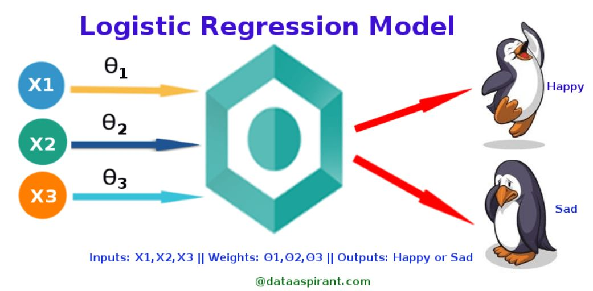
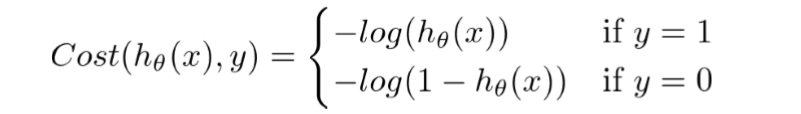
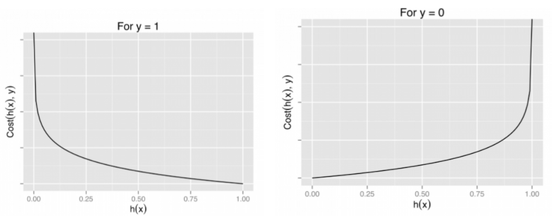
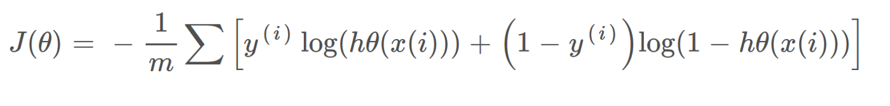

# Logistic Regression

This sub-repository demonstrates the implementation of Logistic Regression algorithm to solve classification problems.

Contents of **Logistic Regression**

* [Image](https://github.com/ppunia74/INDE-577_Fall2022/tree/main/SupervisedLearning/4%20-%20Logistic%20Regression/Image): folder contains images used in README
* [Data](https://github.com/ppunia74/INDE-577_Fall2022/tree/main/SupervisedLearning/4%20-%20Logistic%20Regression/Data): Folders contains all data files used in this module
* [Logistic_Regression.ipynb](https://github.com/ppunia74/INDE-577_Fall2022/blob/main/SupervisedLearning/4%20-%20Logistic%20Regression/Logistic_Regression.ipynb): Jupyter notebook file containing
  * a. Introduction of Logistic Regression algorithm
  * b. Building Logistic Regression algorithm from scratch 
  * c. Performing the algorithm using Pima Indians Diabetes Dataset to predict whether the person would have diabetes or not in the 5 years

### A Short Summary
# Logistic Regression

Logistic Regression is a machine learning algorithm commonly used for classification and prediction problems. Logistic regression is a probabilistic method based on [maximum likelihood estimation](https://towardsdatascience.com/an-introduction-to-logistic-regression-8136ad65da2e).
In logistic regression uses a binary dependent variable. 
The assumption for logistic regression is that: 
- Each pair (x,y) belongs to one of the two complementary categories (0 or 1);
- observations are independent (not from repeated measurements)
- little to no collinearity among the independent variables
- linearity of independent variables and log odds
- The success of the model depends on the sample size (usually requiring large sample sizes to achieve high accuracy)
- The data come from the same underlying distribution and independent of each other.

### Sigmoid Function

Logistic is similar to linear regression in some sense, but it has a more complex function, the sigmoid function, that

The sigmoid function can take any real-valued number and map it into a value between 0 and 1.

### Cost Function:

Graph of logistic regression

The above two cost functions can be combined into a single function

### Algorithm

* Step 1: Randomly select  from the training set
* Step 2: Feed-Forward into the Neural Network
* Step 3: Update weights and bias (choose learning rate )
    - &space;w_1&space;-&space;\alpha&space;(\hat&space;y-y)x_1" title="w_1 -> w_1 - \alpha (\hat y-y)x_1" />
    - &space;w_2&space;-&space;\alpha&space;(\hat&space;y-y)x_2" title="w_2 -> w_2 - \alpha (\hat y-y)x_2" />
    - &space;w_3&space;-&space;\alpha&space;(\hat&space;y-y)" title="w_3 -> w_3 - \alpha (\hat y-y)" />
* Step 4: Repeat Step 1 to Step 3 until desired loss in-sample is reached, or a maximum number of steps is reached

---
