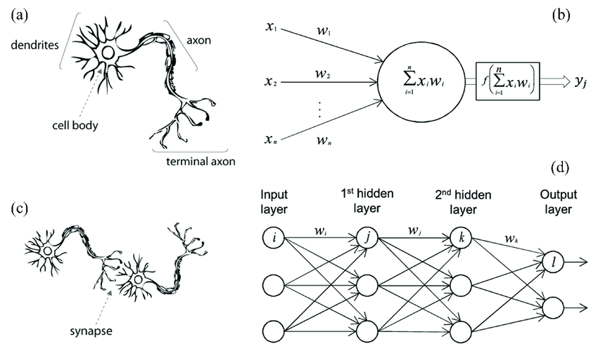

# Neural Network (Multilayer Perceptron Learning Algorithm)

This sub-repository implements a Multilayer Perceptron Learning Algorithm aka neural network on images to predict the labels.

Contents of **Neural Network**

* [Image](): folder contains images used in README
* [MLP_MNIST.ipynb](): Jupyter notebook file contains
  * a. Building Multilayer Perceptron Learning algorithm from scratch
  * b. Performing multilayer perceptron algorithm using MNIST Dataset to classify the handwritten digits
* [MLP.ipynb](): Jupyter notebook file contains
  * a. Introduction of the perceptron algorithm
  * b. Building Multilayer Perceptron Learning algorithm from scratch
  * c. Performing the multilayer perceptron algorithm using Fashion MNIST dataset to classify fashion categories
  * d. Increase the number of nodes in the hidden layers and compare
  * e. Add ReLU function as another activation function and compare

### A Short Summary

# Multilayer Perceptron Learning Algorithm

Multilayer Perceptron Learning algorithm aka neural network is a widely used method for problems such image recognition, speech recognition, natural language etc. The underlying intuition of neural network is that it endeavors to recognize underlying relationships in a set of data through a process that mimics the way the human brain operates. In this sense, neural networks refer to systems of neurons, composed of interconnected neurons that apply a function to inputs that computes outputs with associated weights (w) which designate a given input's relative importance to other inputs.

Neural network algorithm has following components:

* Input Nodes (input layer): no computation is done in this layer, Input nodes passes the initial data into the system for further processing by subsequent layers of artificial neurons. A block of nodes is also called a **layer**.
* Hidden nodes (hidden layer): where intermediate processing/computation occurs; after computing computations, these nodes pass along weights (which can be either signals or information) from the input layer to the following layer, which can be another hidden layer or the output layer. It is also possible to have a neural network without a hidden layer.
* Output nodes (output layer): uses an activation function to map information to the desired output format
* Connections and weights: a *network* consists of connects that transfer the output from neuron i to neuron j, assigned weight W_ij
* Activation Function (aka transfer function): defines output of that node given a set of inputs. Its behavior is similar to the behavior of a single perceptron, but it is the ability to use nonlinear activation functions that allow networks to computer nontrivial problems with a small number of nodes
* Learning rule: algorithm which modifies the parameters of the neural network, in order for a given input to the network to produce a favored output. This *learning* process is often just modifying the weights and thresholds

---

### Datasets

There are two datasets used to implement Multilayer Perceptron Learning algorithm: The Iris Dataset is loaded from sklearn.datasets.

* MNIST Dataset

The MNIST Dataset is loaded from [*keras.dataset*](https://keras.io/api/datasets/). It consists of 70000 28  28 pixel images of hand written digits, 60000 of which are typically used as labeled training examples, where the other 10000 are used for testing your learning model on.

* Fashion MNIST Dataset

The Fashion MNIST Dataset is also loaded from [*keras.dataset*](https://keras.io/api/datasets/). It consists of 70000 28  28 grayscale images of 10 fashion categories, 60000 of which are typically used as labeled training examples, where the other 10000 are used for testing your learning model on.
