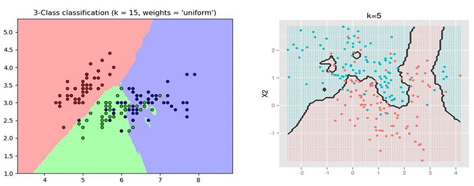
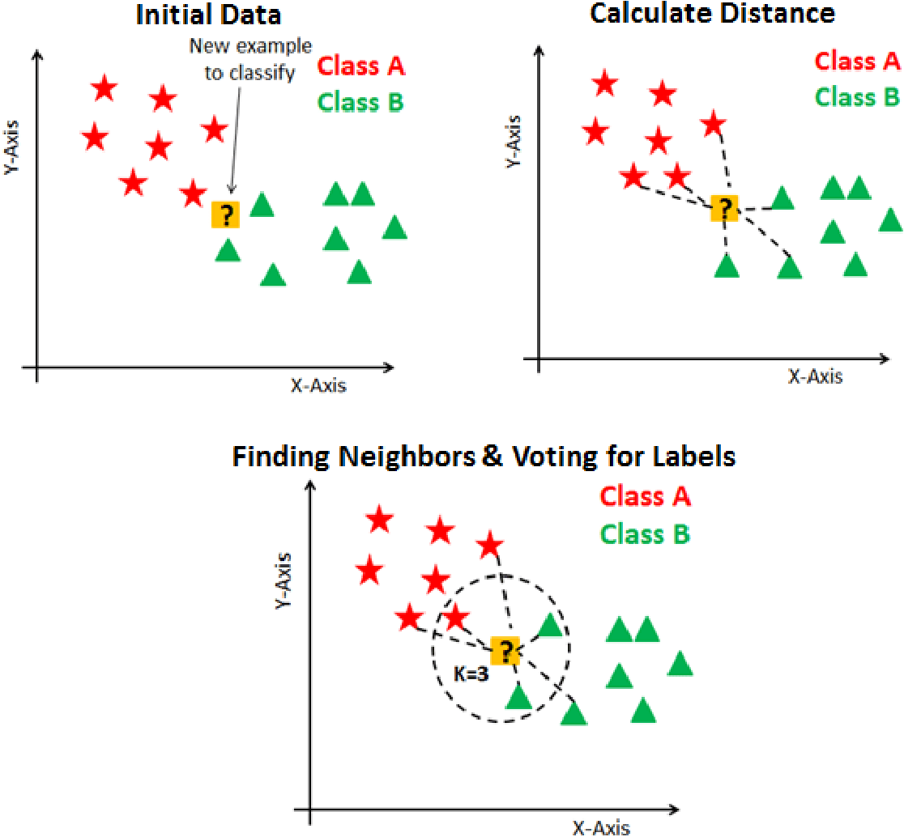

# K Nearest Neighbors (KNN)

This sub-repository demonstrates the implementation of K Nearest Neighbors to solve classification problems.

Contents of **K Nearest Neighbors (KNN)**

* [Image](https://github.com/ppunia74/INDE-577_Fall2022/tree/main/SupervisedLearning/6%20-%20K%20Nearest%20Neighbors%20(KNN)/Image): contains images. 
* [Data](https://github.com/ppunia74/INDE-577_Fall2022/tree/main/SupervisedLearning/6%20-%20K%20Nearest%20Neighbors%20(KNN)/Data): contains dataset used in this module. 
* [KNN.ipynb](https://github.com/ppunia74/INDE-577_Fall2022/blob/main/SupervisedLearning/6%20-%20K%20Nearest%20Neighbors%20(KNN)/KNN.ipynb): Jupyter notebook implementations of
  * 1) Building KNN algorithm from scratch and performing KNN using Hawks Dataset to classify the hawks species
  * 2) Compare the built algorithm with the *KNeighborsClassifier* from sklearn

### A Short Summary

# K Nearest Neighbors (KNN)

K Nearest Neighbors is a simple classification  algorithm that stores all the available cases and classifies new data/case based on a similarity score. It is mostly used for classification of data based on the similarity score with its neighbors. THe application of this approach includes recommendation systems to anomaly detection to image/text classification. KNN can also be used for regression, though this application is less common than classification. 

### Idea

In short, KNN essentially boils down to forming a majority vote between K most similar (i.e. closest) instances to a given "unseen" observation.  In other words, data with similar features "should" be close in space.

### Generalized Algorithm:

1. Load training and testing datasets
2. Specify/choose the value of k (K should be odd for classification)
  influence on the result, while larger values of K will have smoother decision boundaries (meaning lower variance but increased bias... and are computationally expensive). 
   - Alternatively, you can use cross validation: select a cross-validation dataset from the training dataset. Take a small portion from the training dataset and call it a "validation" dataset, then use the same value to evaluate different possible values of K, i.e. predict the label for every instance in the validation set using K = 1, K = 2, K = 3..., then look at which value of K gives the best performance on the validation set and use that value as the final seting.
   - In general, choosing the value of k is k = sqrt(N), where N is the number of samples in the training dataset
3. For each point in the test data:
   a. Calculate the distance between the point and each point in the dataset 
   Two-Dimension formula:
   
   n-Dimention formular:
   
   
   b. Sort the values in ascending order based on distances
   c. Find the top k values from the sorted list
   d. Find the frequency (statistical [mode](https://en.wikipedia.org/wiki/Mode_(statistics)) of the labels of the top k values
   e. Assign the mode to the test data point
   f. The assigned value is the classified (classification) or predicted (regression) value for that particular datapoint.

### How should we measure error?

---

### Datasets

I use Hawks data to implement K Nearest Neighbors (KNN) algorithm:
  
* Hawks Dataset:

The Hawks dataset has 908 cases and 19 columns. The data were collected by the students and faculty from Cornell College at Lake MacBride near Iowa City, Iowa. There are three different species of hawks: Red-tailed, Sharp-shinned, and Cooper's hawks.
