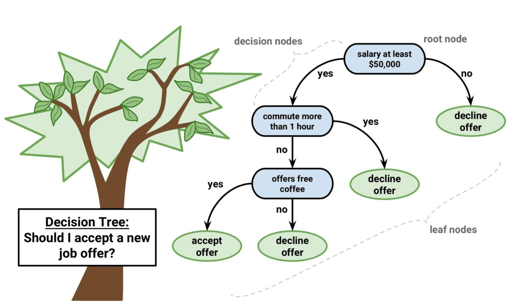

# Decision Tree

This sub-repository mainly focuses on using Decision Tree Algorithm to solve classification problems.

Contents of **Decision Tree**

* [Image](): folder containing images used in README
* [Data](): folder containing all data files used in this module
  * [penguins.csv](): Penguins Dataset
* [Decision Tree.ipynb](): Jupyter notebook file containing
  * a. Introduction of the decision tree algorithm
  * b. Performing the decision tree algorithm using penguins dataset to classify penguins species
  * c. Using confusion matrix to evaluate the algorithm
  * d. Increasing the depth of the decision tree algorithm and compare

### A Short Summary

# Decision Tree

Decision can be used for both classification and regression problems. It uses the analogy of a tree. Each _internal node_ corresponds to an attribute of the data, and each _leaf node_ corresponds to a class label. Decision tree uses a non-parametric supervised machine learning algorithm used for both classification and regression (Regression tree) tasks. Decision tree continuously split data according to a certain parameter. It starts with the root node, which further gets divided into two or more homogeneous sets. The decision nodes are where the data is split, while the leaves are the decisions or the final outcomes.

# Algorithm:
1. Put the best attribute of the dataset at the _root_ of the tree.
   - Compare the values of the root attribute with the record's attribute, then follow the branch corresponding to that value and jump to the next node using the **Sum of Product representation (or Disjunctive Normal Form)**. For a class, every branch from the root of the tree to a leaf node having the same class is a conjunction (product) of values, different branches ending in that class form disjunction (sum).
2. Split training set into _subsets_ in such a way that each subset contains data with the same value for an attribute.
3. Repeat 1-2 on each subset until you find _leaf nodes_ in all the branches of the tree.
   - Compare the record's attribute values with other internal nodes of the tree until we reach a leaf node with the predicted class value 
   - The primary challenge is to determine which attributes should be considered at each level. There are a couple popular attribute selection measures:
     - Entropy (Information gain) is a metric to measures the impurity, or uncertainty in data. 
       - Assume attributes are categorical and try to estimate the information contained by each attribute
       - Entropy measures randomness or uncertainty of a random variable X. In a binary classification problem, if all examples are positive or all are negative, entropy will be 0 (i.e. low). If half the records are of positive class and half are of negative class, entropy is 1 (i.e. high).
       - The formula of entropy is:
      
      
      where  is the total number of classes and  is the probability of class  in the node.

       
   - Gini index: Gini index is used to determine the impurity or purity when building a decision tree in the classification and regression tree (CART) algorithm.
      - Assume attributes are continuous, the index is a metric that measures how often a randomly chosen element would be incorrectly identified. Thus, we prefer a low gini index. The formula of Gini index is

      

      where  is the total number of classes and  is the probability of class  in the node.

   - Information Gain (IG): Information gain is used to decide which feature to split at each step when building the decision tree. A decision tree algorhtim would maximize the value of information gain, and thus, the split with the highest value of information gain will be selected. If a node  is split into  and , the formula of information gain is

    

    where  is the weight, that  and .

   - Confusion Matrix: A confusion matrix is a table used to describe the performance of a classification algorithm. It compares the actual values with those predicted by the model.

There are four basic terms:

* True Positive: An outcome where the model correctly predicts the positive class.
* True Negative: An outcome where the model correctly predicts the negative class.
* False Positive: An outcome where the model incorrectly predicts the positive class.
* False Negative: An outcome where the model incorrectly predicts the negative class.

Based on these four terms, we can also calculate the Accuracy, Recall, Precious, and  score. These parameters can be used to evaluate the algorithm.

There are a few assumptions with the training set: 
- At the beginning, the root is the whole training set
- Feature values are preferred to be categorical. If the values are continuous, they are discretized prior to building the model. 
- Records are distributed recursively on the basis of attribute values
- Order to placing attributes as root or internal node of the tree is done using some statistical approach

Overfitting is a common issue with decision trees. There are two approaches to avoid this:
- Pre-Pruning
  - Stops the tree construction early. It is preferred not to split a node it its goodness measure is below a threshhold, but it's difficult to choose a stopping point
- Post-pruning
  - Build a complete tree. If the tree demonstrates overfitting, then prune using cross-validation data to check the effect. The cross validation data tests whether expanding a node will make an improvement (increase in accuracy) or not

---

### Datasets
* Penguins Dataset:

The Penguins Dataset contains size measurements for three penguin species observed on three islands in the Palmer Archipelago, Antarctica. These data were collected from 2007 - 2009 by Dr. Kristen Gorman's team. It consists of 344 rows and 7 columns. The three different species of penguins are Chinstrap, Adélie, and Gentoo penguins.
