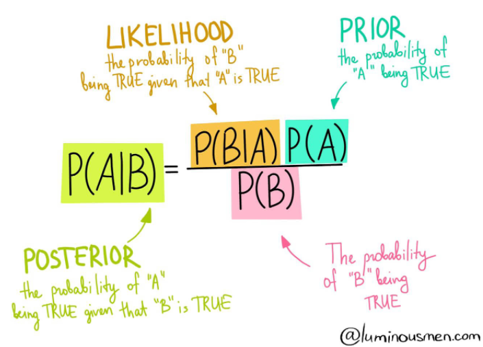

This sub-repository mainly focuses on using Naive Bayes Classifier Algorithm to solve classification problems.

Contents of **Naive Bayes**

* [Image](): contains images used in README
* [Data](): contains all data files used in this module
  * [Hawk.csv](): Hawk Dataset
* [Naive Bayes Classifier.ipynb](): Jupyter notebook file contains the implementation of Naive Bayes Classifier

# Naive Bayes Classifier

Naive Bayes is a classification method based on Bayes Theorem. It is probabilistic method where it is assumed a prior probability of conditions that might be related to the event. Bayes theorem have assumption of independence among predictors. Intuitively, it assumes that the input features to the model are independent of each other, meaning it assumes that changing one input feature will not affect any of the others, even though this is often not the case with datasets. 

**Applications:**
- Real-time Prediction
- Multi-class Prediction
- Text classification/ Spam Filtering/ Sentiment Analysis
- Recommendation Systems

One key benefit of the Naive Bayes over others algorithms like SVM and Ensemble methods is the probabilistic approach: because it computes in real time and generates the outputs instantaneously.

Bayes Rule is represented by the following algorithm (also at the top of this page):
P(A|B) = (P(B|A) * P(A)) / P(B). This tells us how often A happens *given that* B happens, when we know how often B happens *given that* A happens, how likely A is on its own, and how likely B is on its own.

There are three main types of classifiers:
- **Gaussian Naive Bayes**: used when the values of predictors are continuous in nature and it is assumed that they follow Gaussian (normal) distribution
- **Bermoulli Naive Bayes**: used when the predictors are boolean/binary in nautre and it is assumed they follow Bernoulli distribution
- **Multinomial Naive Bayes**: uses multinomimal distribution and is used when features represent frequency of something occurring, like the number of words in a document or text classification purposes

For more details refer to the [this article](https://medium.datadriveninvestor.com/what-are-naive-bayes-classifiers-dd8bc49db817).